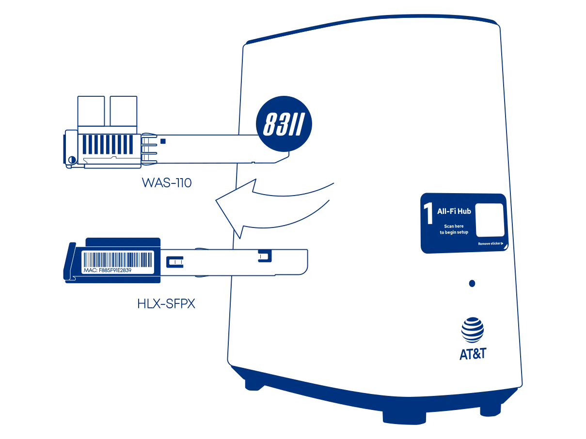
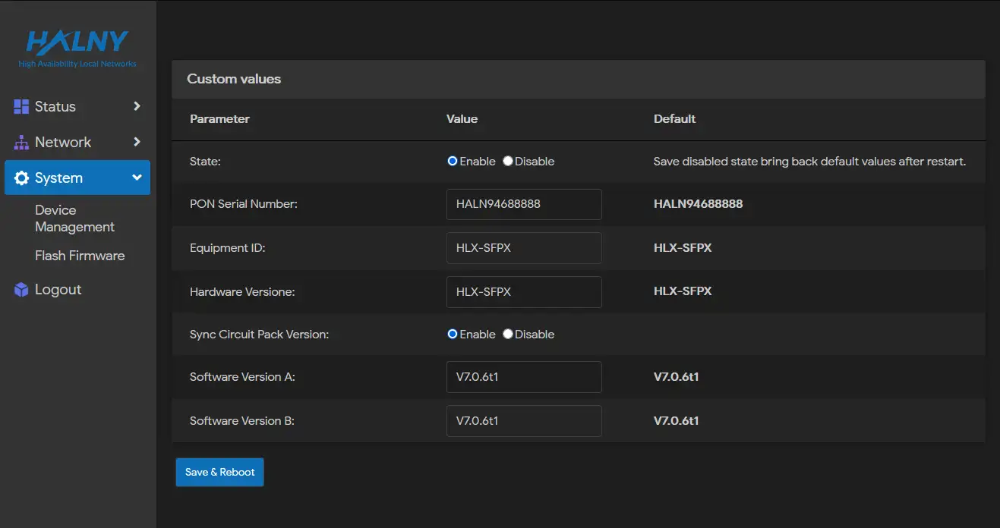

# Masquerade as the AT&T Inc. BGW620-700 with the WAS-110 or HLX-SFPX

{ class="nolightbox" }

<!-- more -->
<!-- nocont -->

!!! warning "New installations"
    Keep the BGW620-700 in active service for roughly a week or two until fully provisioned and the installation ticket
    has been closed.

???+ question "Common misconceptions and answers"

    __Can I take an SFP+ module provided by AT&T and plug it directly into my own router or switch?__

    :   No, the AT&T supplied SFP+ module is only a physical-layer transceiver compliant with XGS-PON
        ([ITU G.9807.1](../xgs-pon/index.md)). It lacks ONT management ([ITU G.988](../xgs-pon/index.md)), meaning it
        cannot function as a standalone ONT.

    __Do the WAS-110 or HLX-SFPX ONTs support GPON wavelengths, specifically 1490 nm downstream and 1310 nm upstream?__

    :   No, the BOSA in these ONTs is calibrated exclusively for XGS-PON wavelengths — 1577 nm downstream and
        1270 nm upstream. They use the Macom M02180 ([WAS-110]) and Semtech GN28L96 ([HLX-SFPX]) drivers, which are
        designed specifically for 10G PON applications.

    __Is the WAS-110 or HLX-SFPX a router?__

    :   No, the [WAS-110] and [HLX-SFPX] are __NOT__ substitutes for a Layer 7 router. They are ONTs, and their sole
        function is to convert Ethernet to PON over fiber. Additional hardware and software are required for internet
        access.

## Determine if you're an XGS-PON subscriber

!!! info "2 Gbps or higher tiers"
    If you're subscribed to 2 GIG speed or a similar 2 Gbps or higher tier, skip past to
    [Purchase a WAS-110 or HLX-SFPX ONT].

### with the web UI <small>recommended</small> { #with-the-web-ui data-toc-label="with the web UI" }

{ loading=lazy }

1. Within a web browser, navigate to
   <http://192.168.1.254/cgi-bin/fiberstat.ha>
2. Check the status listing for the __Wave Length__ value. A reading of *1270 nm* indicates an XGS-PON subscription.

### with the transceiver

1. Identify the bale clasp color. If orange/red, proceed.
2. Engage the bale clasp to release the latch and pull out the transceiver.
3. Inspect label for XGS-PON or 1270 TX.

## Purchase a WAS-110 or HLX-SFPX ONT

The [WAS-110] and [HLX-SFPX] are available from select resellers worldwide; purchase at your discretion. We assume no
responsibility or liability for the listed resellers.

<div class="grid cards" markdown>

-    __WAS-110__

     [Value-Added Resellers](../xgs-pon/ont/bfw-solutions/was-110.md#value-added-resellers)

-    __HLX-SFPX__

     [Value-Added Resellers](../xgs-pon/ont/calix/100-05610.md#value-added-resellers)

</div>

## Install the ONT firmware

=== "WAS-110"

    Although not strictly necessary for AT&T, the 8311 community firmware is highly recommended for masquerading as
    the BGW620-700 and used for the remainder of the WAS-110 sections of this guide.

    There are two (2) methods to install the 8311 community firmware onto the [WAS-110], outlined in the following guides:

    <div class="grid cards" markdown>

    -    __Method 1: <small>recommended</small>__

         [Install the 8311 community firmware on the WAS-110](install-the-8311-community-firmware-on-the-was-110.md)

    -    __Method 2__

         [WAS-110 multicast upgrade and community firmware recovery](was-110-mulicast-upgrade-and-community-firmware-recovery.md)

    </div>

=== "HLX-SFPX"

    [HALNy] has provided a custom firmware with satisfactory customization for masquerading as the BGW62-700.
    It's available by request from [HALNy] and has been made available for download on the
    [8311 Discord community server].

    1. Within a web browser, navigate to <https://192.168.33.1/> and, if asked, input the *useradmin*
       [web credentials]{ data-preview target="_blank" }.
    2. From the main navigation __System__ drop-down, click __Flash Firmware__.
    3. From the __Flash Firmware__ page, click __Choose Image__, browse for `HLX-SFPX_V7-0-6t1.zip`, and click
       __Flash__ to proceed with flashing the firwmare.
    4. Follow the prompts.

## Configure the ONT Settings

Successful masquerading depends on the original ONT serial number and other identifiers (e.g., software versions),
all available via your BGW620-700's fiber stats page:

<http://192.168.1.254/cgi-bin/fiberstat.ha>

=== "WAS-110"

    Choose your preferred setup method: [web UI](#from-the-web-ui) or [shell](#from-the-shell) and carefully follow the
    steps to avoid unnecessary downtime and troubleshooting.

    <h3 id="from-the-web-ui">from the web UI <small>recommended</small></h3>

    ??? info "As of version 2.4.0 `https://` is supported and enabled by default"
        All `http://` URLs will redirect to `https://` unless the `8311_https_redirect` environment variable is set to
        0 or false.

    <div class="swiper" markdown>

    <div class="swiper-slide" markdown>

    { loading=lazy }

    </div>

    <div class="swiper-slide" markdown>

    { loading=lazy }

    </div>

    <div class="swiper-slide" markdown>

    { loading=lazy }

    </div>

    <div class="swiper-slide" markdown>

    { loading=lazy }

    </div>

    </div>

    1. Within a web browser, navigate to
       <https://192.168.11.1/cgi-bin/luci/admin/8311/config>
       and, if asked, input your <em>root</em> password.

    2. From the __8311 Configuration__ page, on the __PON__ tab, fill in the configuration with the following values:

        !!! info "All attributes below are <ins>mandatory</ins>"

        | Attribute                  | Value                   | Remarks                 |
        | -------------------------- | -----------------       | ----------------------- |
        | PON Serial Number (ONT ID) | COMM&hellip;            |                         |
        | Equipment ID               | iONT620700X             |                         |
        | Hardware Version           | BGW620-700_2.5          |                         |
        | Sync Circuit Pack Version  | :check_mark:            |                         |
        | Software Version A         | BGW620_5.31.9           | [Version listing]       |
        | Software Version B         | BGW620_5.31.9           | [Version listing]       |
        | MIB File                   | /etc/mibs/prx300_1U.ini | PPTP i.e. default value |

    3. From the __8311 Configuration__ page, on the __ISP Fixes__ tab, enable __Fix VLANs__ from the drop-down.

    4. __Save__ changes and *reboot* from the __System__ menu.

    <h3 id="from-the-shell">from the shell <small>alternative</small></h3>

    1. Login over secure shell (SSH).

        ``` sh
        ssh root@192.168.11.1
        ```

    2. Configure the 8311 U-Boot environment.

        !!! info "All attributes below are <ins>mandatory</ins>"

        ``` sh
        fwenv_set -8 gpon_sn COMM...
        fwenv_set -8 equipment_id iONT620700X
        fwenv_set -8 hw_ver BGW620-700_2.5
        fwenv_set -8 cp_hw_ver_sync 1
        fwenv_set -8 sw_verA BGW620_5.31.9
        fwenv_set -8 sw_verB BGW620_5.31.9
        fwenv_set -8 fix_vlans 1
        ```

        !!! info "Additional details and variables are described at the original repository [^1]"
            `/usr/sbin/fwenv_set` is a helper script that executes `/usr/sbin/fw_setenv` twice consecutively.

            The WAS-110 functions as an A/B system, requiring the U-Boot environment variables to be set twice, once
            for each environment.

            The `-8` option prefixes the U-Boot environment variable with `8311_`.

    3. Verify the 8311 U-boot environment and reboot.

        ``` sh
        fw_printenv | grep ^8311
        reboot
        ```

    After rebooting the WAS-110, safely remove the SC/APC cable from the BGW620-700 and connect it to the
    WAS-110. If all previous steps were followed correctly, the WAS-110 should operate with O5.1 [PLOAM status].
    For troubleshooting, please read the [Troubleshoot connectivity issues with the WAS-110] guide before seeking help on
    the [8311 Discord community server].

      [PLOAM status]: troubleshoot-connectivity-issues-with-the-was-110.md#ploam-status
      [Troubleshoot connectivity issues with the WAS-110]: troubleshoot-connectivity-issues-with-the-was-110.md
      [8311 Discord community server]: https://discord.com/servers/8311-886329492438671420

=== "HLX-SFPX"

    { loading=lazy }

    1. Within a web browser, navigate to <http://192.168.33.1/cgi-bin/luci/admin/system/halny-settings/> and, if asked,
       input the *useradmin* [web credentials]{ data-preview target="_blank" }.
    3. From the hidden __HALNy Settings__ page, in the __Custom values__ section, fill in the configuration with the
       following values:

        !!! info "All parameters below are <ins>mandatory</ins>"

        | Parameter                  | Value                   | Remarks                 |
        | -------------------------- | -----------------       | ----------------------- |
        | State                      | Enable                  |                         |
        | PON Serial Number          | COMM&hellip;            |                         |
        | Equipment ID               | iONT620700X             |                         |
        | Hardware Version           | BGW620-700_2.5          |                         |
        | Sync Circuit Pack Version  | Enable                  |                         |
        | Software Version A         | BGW620_5.31.9           | [Version listing]       |
        | Software Version B         | BGW620_5.31.9           | [Version listing]       |

    4. Click __Save & Reboot__ to apply the parameters.

!!! tip "Clone the BGW620-700 :purple_circle: __MAC address__ on the router's DHCP WAN interface to avoid waiting for the 20 minute lease to expire."

!!! note "Do not be alarmed..."
    If you receive an e-mail and/or text informing you to:

    > Check your AT&T Fiber equipment since you might be offline currently.

    The BGW620-700 sends telemetry data to *better* the customer experience.

## Software versions

The OLT *can* utilize the software version as a provisioning attribute. It is recommended to stay updated with the
software upgrades of the BGW620-700 if the WAS-110 reports a fake O5 state.

The software version can be acquired by reconnecting the BGW620-700 and navigating to
<http://192.168.1.254/cgi-bin/update.ha> and replacing the `X` placeholders in the following string pattern with the
version number: `BGW620_X.XX.X`.

{{ read_csv('docs/posts/masquerade-as-the-att-inc-bgw620-700-with-the-was-110/versions.csv') }}

  [Purchase a WAS-110 or HLX-SFPX ONT]: #purchase-a-was-110-or-hlx-sfpx-ont
  [WAS-110]: ../xgs-pon/ont/bfw-solutions/was-110.md
  [HLX-SFPX]: ../xgs-pon/ont/calix/100-05610.md
  [HALNy]: https://halny.com/
  [Version listing]: #software-versions
  [Troubleshoot connectivity issues with the WAS-110]: troubleshoot-connectivity-issues-with-the-was-110.md
  [web credentials]: ../xgs-pon/ont/calix/100-05610.md#web-credentials

[^1]: <https://github.com/djGrrr/8311-was-110-firmware-builder>
