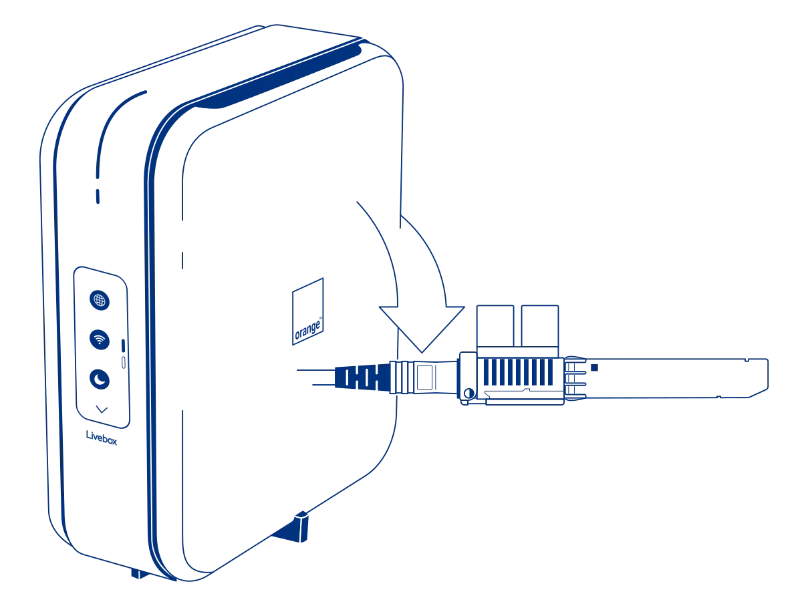

# Masquerade as the Orange S.A. Livebox 7 on XGS-PON with the BFW Solutions WAS-110

{ class="nolightbox" }

<!-- more -->
<!-- nocont -->

## Determine if you're an XGS-PON subscriber

!!! info "5 Gbps or higher packages"
    If you're subscribed to Livebox Max Fibre or a similar 5 Gbps or higher package, skip past to [Purchase a WAS-110].

1. Within a web browser, navigate to
   <https://livebox/>
   and, if asked, input your Administrator password. (1) and click the __Connect__ button.
   { .annotate }

    1. The default Administrator password is the first 12 digits of the WiFi key located on the bottom label of the
       Livebox 7.

2. From the configuration interface, click the cog (:material-cog:) icon at the bottom of the page for
   __Advanced Parameters__ or move forward twice using the right arrow.

3. From the __Advanced Parameters__ page, click the __System Information__ card.

4. From the __System Information__ page, click the __ONT__ tab.

6. From the __ONT__ tab, verify the __Max Bit Rate Supported__ is ***10000Mbps*** for XGS-PON.

    !!! tip "Take note of the Serial Number and ONT Software Versions for the WAS-110 configuration"

## Purchase a WAS-110

The [WAS-110] is available from select [resellers].

 [resellers]: https://pon.wiki/xgs-pon/ont/bfw-solutions/was-110/#value-added-resellers

## Install community firmware

As a prerequisite to masquerading with the WAS-110, the community firmware is necessary; follow the steps
outlined in the community firmware installation guide:

[Install 8311 community firmware on the BFW Solutions WAS-110](install-8311-community-firmware-on-the-bfw-solutions-was-110.md)

## WAS-110 masquerade setup

To successfully masquerade on XGS-PON, the original ONT serial number is mandatory. It, along with other key
identifiers are available from the web UI or the bottom label of the Livebox 7.

### from the web UI <small>recommended</small> { #from-the-web-ui data-toc-label="from the web UI"}

<div class="swiper" markdown>

<div class="swiper-slide" markdown>


</div>

<div class="swiper-slide" markdown>


</div>

</div>

1. Within a web browser, navigate to
   <https://192.168.11.1/cgi-bin/luci/admin/8311/config>
   and, if asked, input your <em>root</em> password.

    ??? info "As of version 2.4.0 `https://` is supported and enabled by default"
        All `http://` URLs will redirect to `https://` unless the `8311_https_redirect` environment variable is set to
        0 or false.

2. From the __8311 Configuration__ page, on the __PON__ tab, fill in the configuration with the following values:

    !!! reminder
        ^^Replace^^ the mandatory __PON serial number__ and optional __Software Verseions__ with the providioned values
        from the Livebox 7 web UI.

    | Attribute                  | Value                        | Mandatory    | Remarks                         |
    | -------------------------- | ---------------------------- | ------------ |-------------------------------- |
    | PON Serial Number (ONT ID) | SMBS03831122                 | :check_mark: | :blue_circle:                   |
    | Equipment ID               | SagemcomFast5694OFR          |              |                                 |
    | Hardware Version           | SMBSXLB7400                  | :check_mark: |                                 |
    | Sync Circuit Pack Version  | :check_mark:                 |              |                                 |
    | Software Version A         | SAHEOFR010117                |              | [Version listing]               |
    | Software Version B         | SAHEOFR919117                |              | [Version listing]               |
    | MIB File                   | /etc/mibs/prx300_1U.ini      | :check_mark: | PPTP i.e. default value         |

3. __Save__ changes and reboot from the __System__ menu.

### from the shell

1. Login over secure shell (SSH).

    ``` sh
    ssh root@192.168.11.1
    ```
2. Configure the 8311 U-Boot environment.

    !!! reminder "Highlighted lines are <ins>mandatory</ins>"
        ^^Replace^^ the mandatory __PON serial number__ and optional __Software Verseions__ with the providioned values
        from the Livebox 7 web UI.

    ``` sh hl_lines="1 3"
    fwenv_set -8 gpon_sn SMBS03831122
    fwenv_set -8 equipment_id SagemcomFast5694OFR
    fwenv_set -8 hw_ver SMBSXLB7400
    fwenv_set -8 cp_hw_ver_sync 1
    fwenv_set -8 sw_verA SAHEOFR010117 # (1)!
    fwenv_set -8 sw_verB SAHEOFR919117
    ```

    1. [Version listing]

    !!! info "Additional details and variables are described at the original repository [^1]"
        `/usr/sbin/fwenv_set` is a helper script that executes `/usr/sbin/fw_setenv` twice consecutively.

        The WAS-110 functions as an A/B system, requiring the U-Boot environment variables to be set twice, once for each
        environment.

        The `-8` option prefixes the U-Boot environment variable with `8311_`.

3. Verify the 8311 U-boot environment and reboot.

    ``` sh
    fw_printenv | grep ^8311
    reboot
    ```

After rebooting, the SC/APC cable can safely be plugged into the [WAS-110] and immediately receive O5
operational status. For troubleshooting, please read:

[Troubleshoot connectivity issues with the BFW Solutions WAS-110]

Finally, continue with your bypass by consulting the [routing guide(s)](#routing-guides).

## Livebox 7 software versions

The software version ^^can^^ be utilized as a provisioning attribute by the OLT, but this is not the case for
the Livebox 7, which uses CWMP[^2]. However, it is recommended to keep somewhat up-to-date with the following listing.

| Software Version 0 | Software Version 1 |
| ------------------ | ------------------ |
| SAHEOFR070202      | SAHEOFR919117      |
| SAHEOFR010117      | SAHEOFR070101      |
| SAHEOFR010113      |                    |
| SAHEOFR010112      |                    |

Please help us by contributing new versions via the
[8311 Discord community server](https://discord.com/servers/8311-886329492438671420)
or submitting a
[Pull Request](https://github.com/up-n-atom/8311/pulls) on GitHub.

## Routing guides

* [OPNsense - Orange France FTTH IPv4 & IPv6](https://docs.opnsense.org/manual/how-tos/orange_fr_fttp.html)
* [Orange bypass on Debian](https://akhamar.github.io/orange-bypass-debian/)

  [Purchase a WAS-110]: #purchase-a-was-110
  [WAS-110]: ../xgs-pon/ont/bfw-solutions/was-110.md#value-added-resellers
  [Version listing]: #livebox-7-software-versions
  [Troubleshoot connectivity issues with the BFW Solutions WAS-110]: troubleshoot-connectivity-issues-with-the-bfw-solutions-was-110.md

[^1]: <https://github.com/djGrrr/8311-was-110-firmware-builder>
[^2]: <https://en.wikipedia.org/wiki/TR-069>
